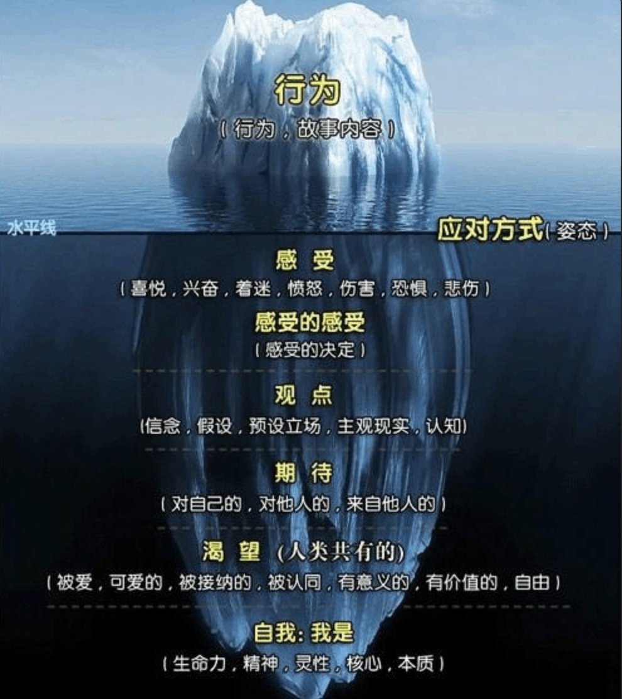

践行 只管去做，学习为目的

在线地址：https://wangcy6.gitbook.io/do_book/

 ## 
 【4月】组织：[分类排序，井井有条]

 - https://www.yuque.com/yiyezhou/mwval5/rz9vgtmgn3gzy3o7?singleDoc# 《【4月】组织：分类排序，井井有条》

   
   
   
   
   
   
   # 强哥思考笔记 

- 2023年05月22日

上周六答疑里100%的问题都是和如何调整心态有关的，有的是如何调整学生心态、有的是如何调整悲观心态，其实心态这个东西挺玄乎的，看不见、摸不着，但大家都觉得它是个很重要的存在，那么心态到底能不能调整呢？到底该怎么调整呢？

1、人的心态是完全可以调整的，如果用萨提亚的冰山模型来看的话，心态应该在“观点”这个层面，包括了主观现实、信念、假设，也就是说：“我是怎么看待此时此刻的自己的？” 是失败？是成功？是自信？是否定？这就是心态，而且是非常主观的，所以就存在调整的可能性

2、既然心态是主观的，那么就有短暂调整和长久调整两种情况，短暂调整往往和我们的情绪以及心理暗示有关，比如加班加到心态崩了，那么休息小憩30分钟，很可能就有个短暂调整，还有去面试的时候很紧张，那么给自己一些积极的心理暗示：“我做了那么充分的准备，一定可以的”，也能够短暂调整

3、那为什么经常给我们的一个感觉是：心态根本改变不了呢？过去不自信，现在还不自信，心态的长久调整可以理解为对自己的认知发生根本性的变化，这个很难，需要建立在一个个小的成功体验之上的，比如我认为自己不擅长当众演讲，但是工作关系必须经常当众演讲，无法逃避，于是我每次都精心准备，别人多花2-3倍的时间，每次演讲效果都还不错，时间长了，我会认为自己其实也挺擅长演讲的，这就是心态的长久调整，一个量变到质变的过程

4、可惜我们每次都是临时抱佛脚，要面试了，心态崩了，赶紧到处求助，面试完了，就把这件事抛到一边，下次面试的时候，继续临时抱佛脚，这样的话，心态是无法真正调整的，台上一分钟，台下十年功，我们要在遇到问题之前就开始行动积累才行

