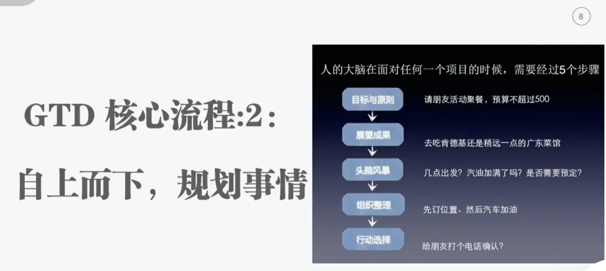

###  第一本书：搞定Ⅲ

#### 视频课程

###  主题：
《搞定 3》2：让你重获掌控力的五个流程详解

⏰ 时间：
7月17日 20:00-21:00

📍地址 ：
https://stqaa.h5.xeknow.com/sl/4AEJmE

——【DO书预习】——
◎ DO书预习《搞定3》第3-9章（第5关），并完成预习作业~

记录：

- 优先级处理事情 四代时间管理方式，别人帮助处理一个技术，你不解决，认为不重要，别人找人解决小技术，小产品，小需求，你不处理结果未来很坑。。。。----

- 你答应承诺 随时捕获到

- 1 项目清单  2  行动清单   3 批次处理清单 4 将来也许清单   5 日程表   6 参考资料  

  

#### 第一关

https://book.douban.com/subject/26612476/

作者简介 · · · · · ·

戴维·艾伦被誉为世界最具影响力的工作效率问题思想家，是纽约人寿公司、世界银行、福特基金会、美国海军等组织的主题演讲人兼主持人，并在全国各地举办针对个人和组织的各种研讨会。他任戴维·艾伦公司董事长，有超过35年的管理顾问和执行教练经验。他的作品主要由快公司、财富杂志、洛杉矶时报、纽约时报、华尔街日报等诸多机构出版。《搞定》已在30多个国家出版。艾伦在荷兰阿姆斯特丹居住。

目录 · · · · · ·

前 言 // V
引 言 从《搞定Ⅰ》到《搞定Ⅲ》// 1
第1 章 GTD 现象 // 1
第2 章 步骤 // 4
第3 章 自我管理的基本内容 // 61
第4 章 获得掌控：捕捉 //
第5 章 获得掌控：明确意义 // 103
第6 章 获得掌控：组织整理 // 12
第7 章 获得掌控：深思 // 1
第8 章 获得掌控：参与 // 16
第9 章 获得掌控：把GTD 运用到工作和生活中 // 18
第10 章 摆正视角 // 1
第11章 紧急问题：下一步行动 // 20
第12 章 1 万英尺：项目 // 21
第13 章 2 万英尺：关注和责任范围 // 22
第14 章 3 万英尺：长短期目标 // 23
第15 章 4 万英尺：愿景 // 24
第16 章 5 万英尺：宗旨和原则 // 2
第17 章 摆正视角：重访“格雷西的花园”// 26
第18 章 实际运用 // 2
第19 章 尾声 // 2 3

开始时间：2023.07-01 结束时间：2023--7-15

#### 第二关

听课作业 ，听完老师的解读分享，请写下三点收获

GTD是一个自下而上 掌控事情，从上而下规划事情系统 ，让你达到不变应万变的，心如水状态的状态。

GTD 事情处理的5个步骤

1. 主动捕捉想法到工作篮---->借助笔纸，数码工具将大脑中全部事情主动记录下来。

2. 明确为了实现想法实现效果什么/接下来做什么，什么时候能搞定 -------无法拖延，无法逃避，必须面对

   - 简化2个版本从时间维度和任务分解维度 完成这个事情我要做什么，这个事情什么时候搞定。

   - 想法是什么, 需要为此付出行动吗  价值观，强烈兴趣爱好驱动，

   - 你不选择 也是一个选择，默认采取别人选择  如果有价值的没有问题（跟从党指挥）

     为世界崛起读书/人工节点考研工作爱情/很多事情强制工作/必须完成不考虑价值意义必须去做，不得不做，不计成本拿下 ，冲锋号响起，无论敌人战场硝烟炮火多么，马上去做。

   - 你不选择 也是一个选择，默认采取别人希望跳入的陷阱 变成美杜莎诱惑，潘多拉魔盒

     八卦新闻，群聊 消息，短视频 直播综艺动漫，铺面而来。抢夺你考研，工作 学生活，他们不管这个，还说你不自控，可与不看。

     

     - 这是什么--->这个事情达到成果是什么。你到底要什么。
     
     - 下一步行动是什么，下一步行动是什么 下一步行动是什么。。。
     
       不是没有时间，没有下一步行动是什么。纠结 焦虑。
     
       
     
     
     
     

   

3. 组织整理 ----> 每天遇到all任务事情都分类下面6个清单

   1 项目清单 2 行动清单   3 等待清单 4 将来也许清单   5 日程表   6参考资料  

4.  深思  ---- 碎片考虑一下做情事情 想想是否遗漏 ， 抓住重点，让别人更容易接受，下次做更好----事情后复盘也是反思。

   > 实现想法实现效果什么/接下来做什么 总结一套方法和能力

5. 执行下一步行动  ---- 根据情景做事情，（餐厅之做吃饭事情），精力强做主要事情

